# Tugas Pertemuan 5

Nama : Aura Devany Salsabila Bachtiar

NIM : H1D022015

Shift Baru: Shift C

## Penjelasan Langkah-Langkah

### Proses Login
1. Menginputkan Email dan Password

   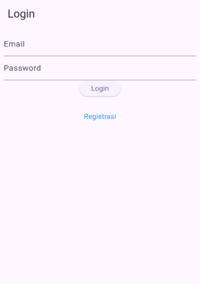
   
   - Form login terdiri dari dua field utama:

     - Email: Pengguna diminta mengisi email dengan format yang benar

     - Password: Pengguna diminta mengisi password dengan minimal 6 karakter.
   - Tombol Login

     Setelah mengisi email dan password, pengguna dapat menekan tombol Login untuk memulai proses autentikasi.

     Ketika tombol Login ditekan, aplikasi akan melakukan validasi form dan memproses login menggunakan `LoginBloc`.
   - Proses login dan validasi

     Aplikasi mengirim data login (email dan password) ke server menggunakan `LoginBloc` dan memeriksa apakah login berhasil atau gagal.
     
     `LoginBloc`: Mengatur logika proses autentikasi, melakukan request ke server, dan mengembalikan hasil login.

  
2. Respon Berhasil/Gagal

   
   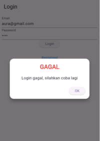
   - Respon Berhasil/Gagal
     - Login Berhasil: Pengguna akan diarahkan ke halaman `ProdukPage`.
     - Login Gagal: Dialog peringatan muncul, memberitahukan bahwa login gagal.

### Proses Register

1. Menginputkan Nama, Email, dan Password
   
   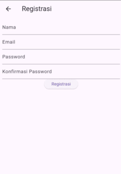
   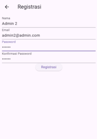
   
2. Respon Berhasil/Gagal
   
   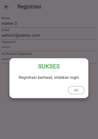
   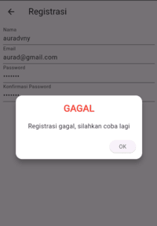

### Proses Tambah Data Produk
1. Menginputkan Kode Produk, Nama Produk, dan Harga

   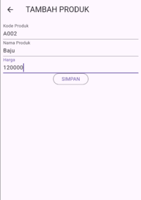
   
   
2. Respon Berhasil/Gagal

   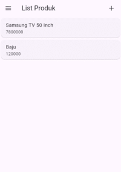
   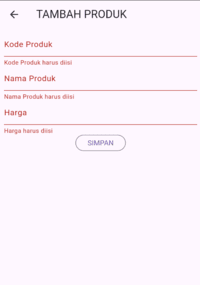

   (input harga harus angka)

### Proses Tampil Data Produk

1. Menampilkan Tampil Data Produk (Nama dan Harga Produk)

   
   
2. Menampilkan Detail Data Produk (Kode Produk, Nama Produk, dan Harga)

   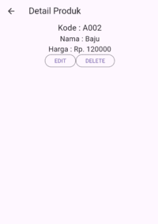

### Proses Edit Data Produk

1. Menampilkan dan Menginputkan Kode Produk, Nama Produk, dan Harga

   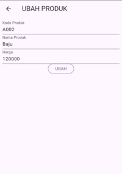
   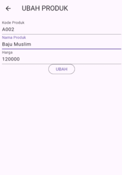
   
3. Respon Berhasil/Gagal

   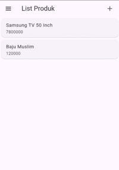
   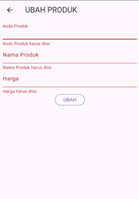

### Proses Delete Data Produk

1. XXX

### Proses Logout

1. XXXX
