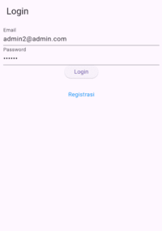
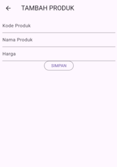

# Tugas Pertemuan 5

Nama : Aura Devany Salsabila Bachtiar

NIM : H1D022015

Shift Baru: Shift C

## Penjelasan Langkah-Langkah

### Proses Register

1. Menginputkan Nama, Email, dan Password
   
   
   

   - Tampilan Halaman Registrasi
     - Pada bagian ini, kita menggunakan `TextFormField` untuk input data, yang mencakup input Nama, Email, Password, dan Konfirmasi Password. Setiap field disertai dengan validasi, sehingga data yang dimasukkan memenuhi syarat yang telah ditentukan (contoh: panjang minimal untuk nama adalah 3 karakter dan password adalah 6 karakter).
     - Tombol Registrasi
       Tombol ini akan memvalidasi form dan jika valid, akan memanggil fungsi `submit` untuk memproses registrasi.
   - Memproses Input Data
     - Jika tombol registrasi diklik, data akan dikirimkan ke server melalui `RegistrasiBloc` yang melakukan request ke API. `RegistrasiBloc` bertanggung jawab untuk mengirim data ke server menggunakan method post dari helper Api.
     - Fungsi `_submit` akan mengirim data ke server dan menampilkan dialog sukses atau gagal. 
   
2. Respon Berhasil/Gagal
   
   
   
   

   - Menampilkan hasil berupa dialog sukses atau gagal.
     - Jika registrasi berhasil, dialog sukses akan ditampilkan
     - Jika registrasi gagal, dialog gagal akan muncul.
     - Jika penginputan data tidak sesuai ketentuan, warning untuk validasi di form akan muncul

### Proses Login
1. Menginputkan Email dan Password

   
   
   - Form login terdiri dari dua field utama:

     - Email: Pengguna diminta mengisi email dengan format yang benar

     - Password: Pengguna diminta mengisi password dengan minimal 6 karakter.
   - Tombol Login

     Setelah mengisi email dan password, pengguna dapat menekan tombol Login untuk memulai proses autentikasi.

     Ketika tombol Login ditekan, aplikasi akan melakukan validasi form dan memproses login menggunakan `LoginBloc`.
   - Proses login dan validasi

     Aplikasi mengirim data login (email dan password) ke server menggunakan `LoginBloc` dan memeriksa apakah login berhasil atau gagal.
     
     `LoginBloc`: Mengatur logika proses autentikasi, melakukan request ke server, dan mengembalikan hasil login.

  
2. Respon Berhasil/Gagal

   
   
   - Respon Berhasil/Gagal
     - Login Berhasil: Pengguna akan diarahkan ke halaman `ProdukPage`.
     - Login Gagal: Dialog peringatan muncul, memberitahukan bahwa login gagal.

### Proses Tambah Data Produk
1. Menginputkan Kode Produk, Nama Produk, dan Harga

   
   

   - Tampilan Halaman Tambah Produk
     - Pada bagian ini, kita menggunakan `TextFormField` untuk input data, yang mencakup input Kode Produk, Nama Produk, dan Harga. Setiap field inputan untuk kode produk dan nama produk berupa teks biasa, serta harga berupa angka.
   - Tombol Submit
     - Tombol Submit untuk mengirimkan data. Tombol ini akan memvalidasi inputan sebelum menyimpan. Jika form valid, akan memanggil fungsi `simpan()`. Fungsi `simpan()` akan embuat objek produk baru dengan mengisi data dari text field, mengirim data ke server menggunakan `ProdukBloc.addProduk`, dan menampilkan dialog sukses atau gagal berdasarkan hasil pengiriman data.
     - Di bagian ini, kita menggunakan `ProdukBloc` untuk melakukan interaksi dengan API backend. Metode `addProduk()` mengirim data ke server.
   
2. Respon Berhasil/Gagal

   
   

   - Menampilkan hasil berupa dialog sukses atau gagal.
     - Jika produk berhasil ditambahkan, pengguna akan diarahkan kembali ke halaman list produk.
     - Jika gagal, akan muncul dialog error, karena tidak sesuai syarat yang ditentukan.

### Proses Tampil Data Produk

1. Menampilkan Tampil Data Produk (Nama dan Harga Produk)

   

   - Menampilkan Daftar Produk (Nama dan Harga Produk)
     - Pada file `produk_page.dart`, terdapat kelas `ProdukPage` yang berfungsi untuk menampilkan daftar produk. Di sini, kita menggunakan widget `FutureBuilder` untuk mendapatkan data produk dari API melalui `ProdukBloc.getProduks()`.
     - Pada `FutureBuilder`, jika data produk sudah berhasil diambil (snapshot memiliki data), komponen `ListProduk` akan dirender. Jika belum, akan menampilkan `CircularProgressIndicator` untuk memberi tahu pengguna bahwa data sedang diambil. Kelas `ListProduk` menerima data produk dalam bentuk list dan menampilkannya dalam bentuk daftar menggunakan `ListView.builder`.
     - Pada setiap elemen list, kita menggunakan widget `ItemProduk` yang akan menampilkan nama dan harga dari produk menggunakan widget `ListTile`.
     - Setiap item produk dapat diklik. Saat item diklik, pengguna akan diarahkan ke halaman detail produk (`ProdukDetail`)
  
2. Menampilkan Detail Data Produk (Kode Produk, Nama Produk, dan Harga)

   

   - Setelah pengguna mengklik sebuah produk, mereka akan diarahkan ke halaman `ProdukDetail` (dengan menampilkan Kode Produk, Nama Produk, dan Harga Produk)
   - Di bagian bawah halaman detail produk, terdapat dua tombol untuk mengedit (akan membawa pengguna ke form untuk mengedit data produk melalui navigasi ke `ProdukForm`) dan menghapus produk (akan mengonfirmasi penghapusan produk. Jika pengguna memilih untuk melanjutkan, produk akan dihapus menggunakan `ProdukBloc.deleteProduk`)

### Proses Edit Data Produk

1. Menampilkan dan Menginputkan Kode Produk, Nama Produk, dan Harga

   
   

   - Tampilan Halaman Ubah Produk
     - Pada halaman `ProdukForm`, pengguna dapat mengedit data produk (Kode Produk, Nama Produk, dan Harga Produk). Ketika pengguna membuka halaman ini, data yang ada akan dimuat ke dalam form sebagai nilai awal.
     - `initState()`: Memeriksa apakah `widget.produk` berisi data (jika produk sedang diedit). Jika ya, nilai-nilai produk tersebut diisi dalam field form, dan tombol submit diubah menjadi "UBAH".
     - Field input ini menggunakan widget `TextFormField` untuk memasukkan data produk seperti Kode, Nama, dan Harga.
   - Tombol Ubah
     - Setelah pengguna selesai menginputkan atau mengubah data, mereka dapat menekan tombol submit. Tombol ini akan menjalankan logika penyimpanan atau pengubahan produk sesuai dengan apakah pengguna sedang mengedit produk atau menambahkan produk baru.
     - Saat tombol ditekan, validasi dilakukan terlebih dahulu. Jika semua field valid, aplikasi memutuskan apakah produk akan diperbarui (fungsi ubah) atau ditambah (fungsi simpan).
     - Produk yang diupdate adalah produk yang sudah ada, identifikasinya menggunakan `id` produk yang ada di dalam `widget.produk`. 
   
2. Respon Berhasil/Gagal

   
   

   - Aplikasi menampilkan respons kepada pengguna setelah proses simpan atau ubah selesai.
     - Berhasil: Aplikasi akan berpindah kembali ke halaman `ProdukPage` yaitu List Produk jika proses berhasil.
     - Gagal: Jika proses gagal (karena data inputan tidak sesuai syarat), aplikasi menampilkan dialog peringatan menggunakan `WarningDialog`.

### Proses Delete Data Produk

1. Menampilkan Pop Up Delete
   
    

   - Tampilan Halaman Detail Produk
     - Aplikasi menampilkan detail produk yang mencakup Kode Produk, Nama Produk, dan Harga Produk. Tombol untuk Edit dan Hapus data produk disediakan di bawah detail produk melalui widget `OutlinedButton`.
     - Ketika tombol DELETE ditekan, akan memicu metode `confirmHapus()`.
   - Fungsi `confirmHapus()` akan menampilkan AlertDialog yang berisi pesan konfirmasi: "Yakin ingin menghapus data ini?".
     - AlertDialog ini memiliki dua tombol:
       - Ya – untuk mengonfirmasi penghapusan
       - Batal – untuk membatalkan aksi.

2. Respon Berhasil/Batal

   
   

   - Proses Hapus Berhasil
     - Jika pengguna memilih tombol Ya, maka produk akan dihapus dengan memanggil fungsi deleteProduk() dari ProdukBloc berdasarkan id produk yang ingin dihapus. Jika penghapusan berhasil, pengguna akan diarahkan kembali ke halaman ProdukPage.
     - Jika penghapusan gagal (misalnya karena ada masalah koneksi atau kesalahan lain), maka akan muncul `WarningDialog` yang berisi pesan "Hapus gagal, silahkan coba lagi".
   - Proses Batal
     - Jika pengguna memilih tombol Batal, maka dialog akan ditutup tanpa melakukan aksi apa pun. Dialog ditutup dengan `Navigator.pop(context)`.

### Proses Logout

1. Menampilkan Sidemenu Logout

   

   - Tampilan Sidemenu
     - Tampilan halaman produk (ProdukPage) dilengkapi dengan fitur drawer yang berfungsi sebagai navigasi samping. Drawer ini diimplementasikan menggunakan widget `Drawer`, yang menampilkan daftar item melalui `ListView`. Salah satu item dalam list ini adalah tombol Logout.
     - `ListTile` pada drawer digunakan untuk menampilkan opsi Logout. Opsi ini terdiri dari:
       - Title: Menampilkan teks "Logout".
       - Trailing Icon: Menampilkan ikon logout dengan ikon `Icons.logout`.
     - Saat item ini ditekan, metode `onTap` akan dijalankan, yang melakukan proses logout dan pengalihan ke halaman LoginPage.

2. Respon Berhasil

   

   - Proses Logout
     - Fungsi logout diimplementasikan dalam metode `LogoutBloc.logout()`. Fungsi ini melakukan proses logout dari aplikasi. Setelah logout berhasil, aplikasi akan diarahkan kembali ke halaman login (`LoginPage`). 
     - Fungsi `LogoutBloc.logout()` memanfaatkan pendekatan asynchronous (`async` dan `await`) untuk memastikan bahwa proses logout selesai sebelum melanjutkan ke langkah berikutnya.
     - Fungsi `pushAndRemoveUntil()` digunakan untuk mengganti halaman saat ini dan semua halaman sebelumnya dengan halaman baru, dalam hal ini, halaman login (`LoginPage`). Dengan cara ini, setelah logout, pengguna tidak bisa kembali ke halaman produk atau halaman lain di aplikasi.
   
